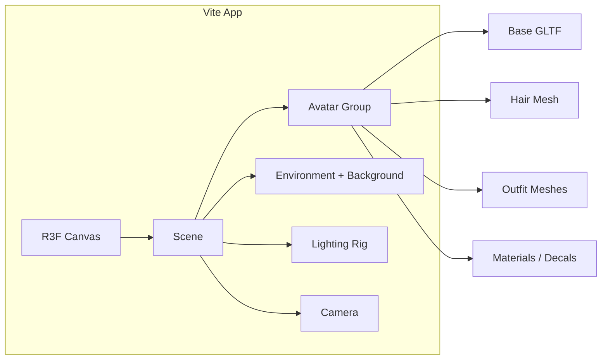

# Phase 1: Hyper-Realistic 3D Avatar (Black Lotus Goddess)

## Scope

- **In scope**: Single 3D female figure, Iggy-inspired design (face, hair, makeup, outfit, pose), low-angle camera, moody lighting with red accents, dark luxurious background, auto-save and live preview.
- **Out of scope**: Animation, multiple characters, backend, or non-avatar features.

## Tech Stack

- **Vite** (React + TypeScript) for fast dev server and HMR (“auto-save” via hot reload; optional localStorage checkpoints later).
- **React Three Fiber (R3F)** + **@react-three/drei** for declarative Three.js (cameras, lights, `useGLTF`, environment, shadows).
- **Three.js** as the underlying renderer (PBR, shadows, tone mapping).

## Architecture (High Level)

## 1. Project Scaffolding

- Create `d:\the project` as a Vite React-TS app: `npm create vite@latest . -- --template react-ts`.
- Install: `three`, `@react-three/fiber`, `@react-three/drei`, and types `@types/three` if needed.
- Add a single entry: `src/App.tsx` that renders an R3F `<Canvas>` and a `<Scene>` component. Ensure `index.html` has a full-viewport root and no default margin.

## 2. Scene and Camera

- **Camera**: Perspective camera, low-angle look-up (e.g. position `(0, 0.5, 3)` or similar, target `(0, 1.2, 0)` so the figure is viewed from below). Use R3F’s default camera or `<PerspectiveCamera>` with `makeDefault`.
- **Background**: Dark, luxurious feel—use either:
  - A dark environment map (e.g. soft studio HDRI, darkened) via Drei’s `<Environment>` with low intensity, or
  - A large dark plane/mesh behind the avatar with a soft “velvet” texture (procedural or image) and subtle gradient.
- **Tone mapping**: Use `toneMapping={ACESFilmicToneMapping}`, `toneMappingExposure` tuned for a moody look (e.g. 0.6–0.8).

## 3. Lighting (Moody and Cinematic)

- **Key light**: One main directional or spot from above/side to create strong cheekbone and jaw shadows; cast shadows enabled.
- **Fill**: Soft, dim fill (second directional or hemisphere) to avoid crushed blacks.
- **Rim / accent**: One or two rim lights with **subtle red** (`color="#ff3333"` or similar, low intensity) to catch hair and shoulders; optional second rim in cool tone for contrast.
- **Ambient**: Low ambient (or none) to keep the scene dramatic.
- All implemented as R3F/Drei components (`directionalLight`, `spotLight`, etc.) with shadow maps on the key light.

## 4. Avatar Implementation Strategy

**Realism note**: True “hyper-realistic” faces and flowing hair in the browser usually require high-quality 3D assets (scanned or sculpted). The plan achieves a **stunning, high-fashion** result by combining a **base female GLTF model** with custom materials and meshes.

- **Option A (recommended)**  
  - Use a **base female GLTF** (e.g. from Mixamo, Sketchfab, Ready Player Me, or a purchased asset).  
  - Place the file in `public/models/` (e.g. `avatar-base.glb`).  
  - Load with Drei’s `useGLTF` in an `<Avatar>` component.  
  - Apply custom **skin material** (MeshStandardMaterial or custom shader) with:  
    - Base skin tone; optional normal/roughness maps if the model has UVs.  
    - **Makeup**: Red lipstick and winged eyeliner via a small **decal** (Drei’s `Decal`) or a second UV-mapped texture overlay; **beauty mark** as a small decal or texture on one cheek.
  - **Hair**: Either part of the GLTF or a **separate GLTF/custom mesh** (long, flowing shape); material with **platinum blonde** albedo and slight specular.  
  - **Outfit**: Built from simple meshes (capsules, boxes, extruded shapes) or very simple GLTFs:  
    - Sleek **black structured top** (torso), **long black gloves** (arms), **tall black stiletto boots** (legs/feet), **statement choker** (torus or thin cylinder around neck).  
    - All black materials with slight roughness variation (e.g. matte fabric vs. slight sheen on boots).
- **Option B (no base model yet)**  
  - Use a **placeholder** (e.g. simple capsule or T-pose mannequin from Drei/Three primitives) so the pipeline runs.  
  - Implement **same lighting, camera, background, and outfit/hair structure** so that swapping in a GLTF later only requires replacing the body mesh and adding face decals.

**Pose**:  

- If the base model has a T-pose or A-pose, apply a **rotation/pose** (via group transforms or, if available, skeleton pose) so she stands **strong and commanding** (e.g. weight on one leg, shoulders back, head slightly raised).  
- Position the group so the camera’s low angle emphasizes height and presence.

## 5. File and Component Layout

- `src/App.tsx` – R3F `<Canvas>`, `<Scene>`.
- `src/components/Scene.tsx` – Camera, background/environment, lighting, and `<Avatar>`.
- `src/components/Avatar.tsx` – Load base model, apply materials, attach hair and outfit; pose group.
- `src/components/Hair.tsx` – Platinum blonde hair mesh (or wrapper around GLTF).
- `src/components/Outfit.tsx` – Top, gloves, boots, choker (black materials).
- `src/components/face/MakeupDecals.tsx` (or inline in Avatar) – Lipstick, eyeliner, beauty mark (Decals or texture overlay).
- `public/models/` – `avatar-base.glb` (and optional `hair.glb` if used).

Drei helpers to use: `useGLTF`, `Environment`, `Decal`, `Center`, `Bounds` (for framing), and R3F `useFrame` only if subtle animation is added later.

## 6. Auto-Save and Preview

- **Auto-save**: Rely on **Vite HMR** so every file save refreshes the app. Optionally add a simple “checkpoint” that writes current camera/pose/config to `localStorage` on a timer or on blur (can be a follow-up).
- **Preview**: Run `npm run dev` and open the reported URL (e.g. `http://localhost:5173`) in the browser. You can use the Cursor IDE browser MCP to capture a snapshot after each major step.

## 7. Implementation Order

1. Scaffold Vite + React + R3F + Drei; minimal full-screen canvas and scene.
2. Add camera (low angle) and dark background (environment or plane).
3. Add lighting rig (key, fill, red rim); tune shadows and tone mapping.
4. Create `Avatar` component: load placeholder or base GLTF; position and pose.
5. Add outfit (black top, gloves, boots, choker) and hair (platinum blonde).
6. Add face details (lipstick, eyeliner, beauty mark) via decals or textures.
7. Polish: exposure, rim intensity, background texture, and final pose.

## 8. Asset Sourcing (No Edits, Reference Only)

- **Base female model**: Mixamo (rigged, often need to export as GLTF), Sketchfab (filter by CC or purchasable), or Ready Player Me–style GLTF. For a standing “goddess” pose, a high-quality static or single-pose model is enough for phase 1.  
- **Hair**: Same GLTF as body, or a separate hair model/plane with alpha for strands.  
- **Environment/HDRI**: Poly Haven or similar for a dark studio HDRI.

## 9. Risks and Mitigations

- **No GLTF available**: Proceed with Option B (placeholder body + full lighting/outfit/hair pipeline); document where to replace with `avatar-base.glb`.  
- **Performance**: Keep one avatar, shadow map size reasonable (e.g. 2048), and a single environment map so the preview stays smooth.

---

**Deliverable for Phase 1**: A running Vite app that shows one commanding, high-fashion female avatar (Iggy-inspired look) with platinum hair, bold makeup, black outfit and choker, low-angle camera, moody lighting with red accents, and dark luxurious background, with code organized as above and preview via dev server (and optionally MCP browser).